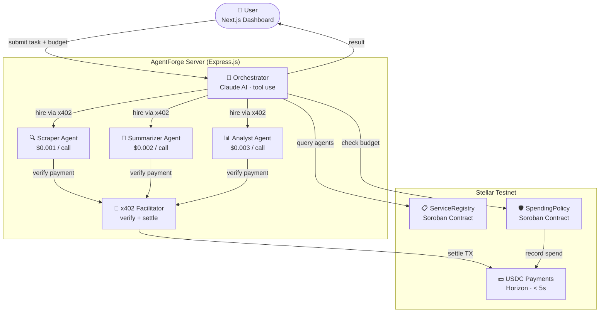
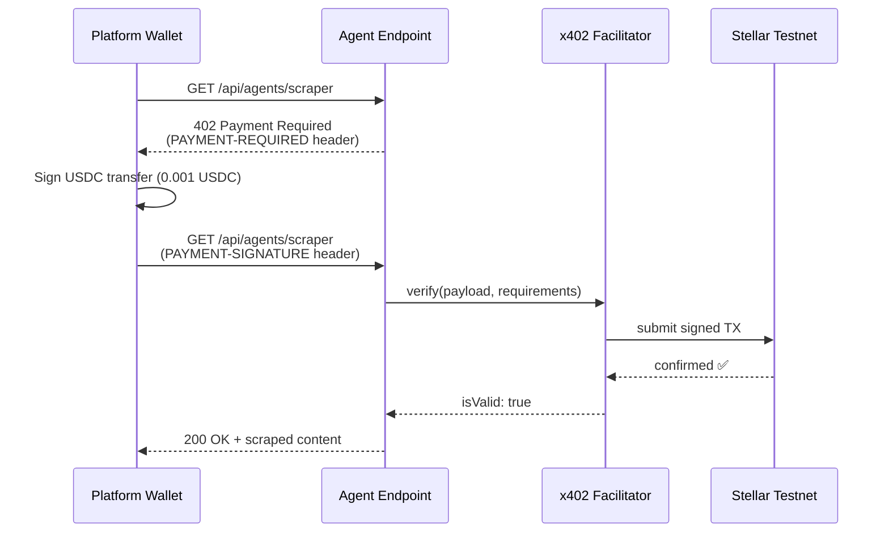

# AgentForge

> A multi-agent service economy on Stellar where AI agents autonomously discover, hire, and pay each other via x402 micropayments and Soroban smart contracts — no wallets, no API keys, no human in the loop.

[](https://dorahacks.io/hackathon/stellar-agents-x402-stripe-mpp/detail)
[](https://stellar.expert/explorer/testnet)
[](LICENSE)

---

## Table of Contents

- [Overview](#overview)
- [Why Stellar](#why-stellar)
- [Live Demo](#live-demo)
- [Architecture](#architecture)
- [Tech Stack](#tech-stack)
- [Project Structure](#project-structure)
- [Getting Started](#getting-started)
- [Smart Contracts](#smart-contracts)
- [Payment Flows](#payment-flows)
- [API Reference](#api-reference)
- [Environment Variables](#environment-variables)

---

## Overview

AgentForge solves a fundamental problem in AI agent systems: **agents cannot pay each other**.

Every AI API today is either free (rate-limited) or subscription-based ($99/month flat). Micropayments were impossible because every payment rail had minimum fees that exceeded the value of the transaction.

| Rail | Fee per transaction | $0.001 payment viable? |
|---|---|---|
| Bank wire | $25.00 | No — fee is 25,000x the payment |
| Stripe | $0.30 | No — fee is 300x the payment |
| Ethereum | $2.00 | No — fee is 2,000x the payment |
| **Stellar** | **$0.000001** | **Yes — fee is 0.1% of the payment** |

AgentForge uses Stellar's fee structure to build the first truly autonomous agent-to-agent service economy.

**What it does:**

1. User submits a task (e.g. *"Research the top 3 Stellar DeFi projects"*) with a USDC budget
2. The Orchestrator (Claude AI) decomposes the task into subtasks
3. It queries the on-chain **ServiceRegistry** (Soroban) to discover available specialist agents
4. It checks the **SpendingPolicy** (Soroban) to verify budget constraints
5. It hires each agent — paying **$0.001–$0.003 USDC per call** via x402 over HTTP
6. Payments settle on Stellar testnet in under 5 seconds
7. User receives a complete, AI-generated report

Total cost: **$0.006 USDC** across 3 Stellar transactions, completed in under 5 minutes.

---

## Why Stellar

- **$0.000001 per transaction** — the only rail where $0.001 agent payments are profitable
- **x402 protocol** — HTTP-native pay-per-call, no API keys or subscriptions
- **Soroban smart contracts** — on-chain service registry and spending guardrails
- **USDC native** — stable micropayments without volatility risk
- **5-second finality** — agents don't wait for payment confirmation

---

## Live Demo

**Deployed contracts on Stellar Testnet:**

| Contract | Address |
|---|---|
| ServiceRegistry | `CDQXE54HXAIB7SPAWR7MMJAJT6JBMKFDDLOITBVRXXTME7UHO43PLRH3` |
| SpendingPolicy | `CAVKJDIF5CWDRTRGQCVETSRFDSMDNSHPAVI6UE342G76ZK3JST2TKDAE` |

To run locally: see [Getting Started](#getting-started).

---

## Architecture



### x402 Payment Flow



---

## Tech Stack

| Layer | Technology |
|---|---|
| AI Orchestration | [Claude API](https://anthropic.com) with tool use (`claude-sonnet-4-6`) |
| Pay-per-call | [x402 protocol](https://github.com/coinbase/x402) (`@x402/stellar`, `@x402/express`) |
| Service Discovery | Soroban ServiceRegistry contract (Rust) |
| Spending Guardrails | Soroban SpendingPolicy contract (Rust) |
| Settlement | Stellar Testnet · USDC · < 5s finality |
| Backend | Express.js · TypeScript · WebSockets |
| Frontend | Next.js 15 · Tailwind CSS v4 |
| Monorepo | Turborepo |

---

## Project Structure

```
AgentForge/
├── apps/
│   ├── server/                  # Express.js backend
│   │   └── src/
│   │       ├── agents/          # Orchestrator, Scraper, Summarizer, Analyst
│   │       ├── payments/        # x402 client, facilitator, payment ledger
│   │       ├── routes/          # tasks, agents, payments API routes
│   │       ├── stellar/         # Horizon client, Soroban registry & policy
│   │       └── websocket/       # Real-time activity feed
│   └── web/                     # Next.js dashboard
│       ├── app/                 # App router pages
│       └── components/          # AgentActivityFeed, PaymentExplorer, ServiceRegistry
├── packages/
│   └── contracts/               # Soroban smart contracts (Rust)
│       ├── service-registry/    # On-chain agent marketplace
│       └── spending-policy/     # Daily/per-tx USDC spending limits
├── .env                         # Environment variables (gitignored)
└── turbo.json                   # Monorepo build config
```

---

## Getting Started

### Prerequisites

- **Node.js** 20+
- **Rust** + `wasm32-unknown-unknown` target (for contracts)
- **Stellar CLI** (`cargo install --locked stellar-cli`)

### 1. Clone and install

```bash
git clone https://github.com/HACK3R-CRYPTO/AgentForge.git
cd AgentForge
npm install
```

### 2. Configure environment

```bash
cp .env.example .env
```

Fill in `.env` with your keys — see [Environment Variables](#environment-variables).

You need:
- An Anthropic API key with credits (get one at [console.anthropic.com](https://console.anthropic.com))
- Stellar testnet keypairs (generate with `stellar keys generate`)
- A platform wallet funded with testnet USDC (see [apps/server/README.md](apps/server/README.md))

### 3. Start the backend

```bash
cd apps/server
npx tsx src/index.ts
```

Server runs on `http://localhost:4021`. Facilitator runs on `http://localhost:4022`.

### 4. Start the frontend

```bash
cd apps/web
npm run dev
```

Dashboard runs on `http://localhost:3000`.

### 5. Submit a task

Open `http://localhost:3000`, type a task, set a budget, and click **Launch Agent Swarm**.

---

## Smart Contracts

Both contracts are deployed on Stellar Testnet and their source is in `packages/contracts/`.

### ServiceRegistry

On-chain marketplace for agent services. Agents register their name, endpoint, price, payment type, and category. The Orchestrator queries this contract to discover which agents are available before hiring them.

**Key functions:**
- `register_service(name, description, endpoint, price, payment_type, category)` — register an agent
- `query_services(category)` — discover agents by category
- `get_service(id)` — fetch a specific service
- `update_reputation(id, score)` — update reputation score after a job

### SpendingPolicy

Enforces programmable spending limits for the Orchestrator. Prevents agents from going over budget.

**Key functions:**
- `initialize(daily_limit, per_tx_limit)` — set budget caps
- `check_and_record_spend(amount)` — check budget and record the spend atomically
- `get_status()` — returns daily limit, spent today, remaining, reset date

---

## Payment Flows

### x402 (Per-Call)

Standard x402 protocol over HTTP. Each agent call requires a separate USDC micropayment.

```
1. Platform wallet  →  GET /api/agents/scraper
2. Server           ←  402 Payment Required
                        PAYMENT-REQUIRED: <base64 requirements>
3. Platform wallet  →  signs Stellar USDC transfer (amount: 0.001 USDC)
4. Platform wallet  →  GET /api/agents/scraper
                        PAYMENT-SIGNATURE: <signed payload>
5. Facilitator      →  verify(payload, requirements)
6. Facilitator      →  settle → submit TX to Stellar testnet
7. Server           ←  200 OK + scraped content
```

### MPP (Machine Payment Protocol)

Used for the Summarizer agent — opens a payment channel for streaming payments during longer-running tasks.

---

## API Reference

### Tasks

| Method | Endpoint | Description |
|---|---|---|
| `POST` | `/api/tasks` | Submit a new task `{ prompt, budget }` |
| `GET` | `/api/tasks/:id` | Get task status and result |
| `GET` | `/api/tasks` | List all tasks |

### Agents (x402-gated)

| Method | Endpoint | Description |
|---|---|---|
| `GET` | `/api/agents/scraper?url=` | Scrape and extract content from a URL |
| `POST` | `/api/agents/summarizer` | Summarize text `{ text, style }` |
| `POST` | `/api/agents/analyst` | Analyze data `{ data, question }` |
| `GET` | `/api/agents` | List all registered services |

### Payments

| Method | Endpoint | Description |
|---|---|---|
| `GET` | `/api/payments/history` | x402 micropayment ledger |
| `GET` | `/api/payments/budget` | Soroban SpendingPolicy status |
| `GET` | `/api/payments/balances` | USDC balances for all agent wallets |

### Debug (no payment required)

| Method | Endpoint | Description |
|---|---|---|
| `GET` | `/test/scraper?url=` | Test scraper agent directly |
| `GET` | `/test/summarizer?text=` | Test summarizer agent directly |
| `GET` | `/test/analyst` | Test analyst agent directly |
| `GET` | `/health` | Server health check |

---

## Environment Variables

| Variable | Description |
|---|---|
| `ANTHROPIC_API_KEY` | Claude API key with credits |
| `ORCHESTRATOR_PUBLIC_KEY` | Stellar public key for the orchestrator |
| `ORCHESTRATOR_SECRET_KEY` | Stellar secret key for the orchestrator |
| `SCRAPER_PUBLIC_KEY` | Stellar public key for the scraper agent |
| `SCRAPER_SECRET_KEY` | Stellar secret key for the scraper agent |
| `SUMMARIZER_PUBLIC_KEY` | Stellar public key for the summarizer agent |
| `SUMMARIZER_SECRET_KEY` | Stellar secret key for the summarizer agent |
| `ANALYST_PUBLIC_KEY` | Stellar public key for the analyst agent |
| `ANALYST_SECRET_KEY` | Stellar secret key for the analyst agent |
| `FACILITATOR_PUBLIC_KEY` | Stellar public key for the x402 facilitator |
| `FACILITATOR_SECRET_KEY` | Stellar secret key for the x402 facilitator |
| `PLATFORM_PUBLIC_KEY` | Stellar public key for the platform payment wallet |
| `PLATFORM_SECRET_KEY` | Stellar secret key for the platform payment wallet |
| `SERVICE_REGISTRY_CONTRACT_ID` | Deployed Soroban ServiceRegistry contract address |
| `SPENDING_POLICY_CONTRACT_ID` | Deployed Soroban SpendingPolicy contract address |
| `USDC_CONTRACT_ID` | USDC Stellar Asset Contract address |
| `MOCK_MODE` | Set to `true` to skip real AI/payments (frontend dev) |
| `PORT` | API server port (default: `4021`) |
| `FACILITATOR_PORT` | Facilitator server port (default: `4022`) |
| `FRONTEND_URL` | Frontend origin for CORS (default: `http://localhost:3000`) |

---

## License

MIT — built in 10 days, every line open source.
