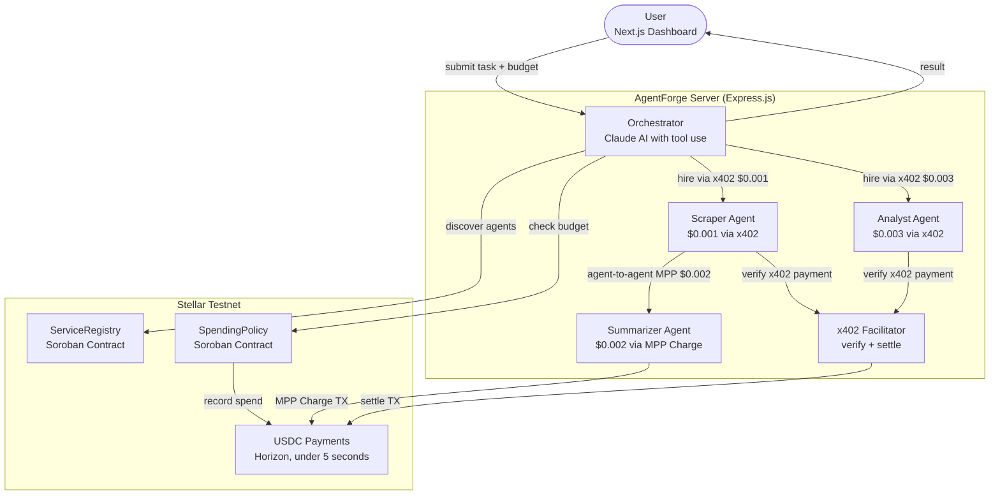
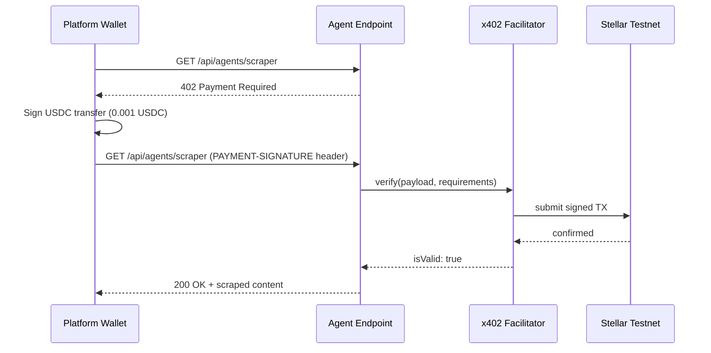

# AgentForge

A multi-agent service economy on Stellar. AI agents autonomously discover, hire, and pay each other for work using USDC micropayments. No wallets. No API keys. No human in the loop.

Built for [Stellar Hacks: Agents 2026](https://dorahacks.io/hackathon/stellar-agents-x402-stripe-mpp/detail).

| | |
|---|---|
| **Live backend** | `https://agentforgeserver-production.up.railway.app` |
| **Live frontend** | `https://agent-forge-web-henna.vercel.app` |
| **ServiceRegistry** | `CDQXE54HXAIB7SPAWR7MMJAJT6JBMKFDDLOITBVRXXTME7UHO43PLRH3` [(view)](https://stellar.expert/explorer/testnet/contract/CDQXE54HXAIB7SPAWR7MMJAJT6JBMKFDDLOITBVRXXTME7UHO43PLRH3) |
| **SpendingPolicy** | `CAVKJDIF5CWDRTRGQCVETSRFDSMDNSHPAVI6UE342G76ZK3JST2TKDAE` [(view)](https://stellar.expert/explorer/testnet/contract/CAVKJDIF5CWDRTRGQCVETSRFDSMDNSHPAVI6UE342G76ZK3JST2TKDAE) |

---

## What it does

You submit a task with a USDC budget. The Orchestrator (Claude AI with tool use) breaks it into subtasks, queries the on-chain ServiceRegistry to find specialist agents, checks the SpendingPolicy contract for budget limits, and hires each agent with a micropayment. Results come back in under 30 seconds. Total cost: $0.006 USDC.

The key part: the Scraper agent autonomously pays the Summarizer agent from its own Stellar wallet. The Orchestrator is not involved. Two separate wallets, two separate Stellar transactions, zero platform involvement. That is a real agent-to-agent economy.

```
User submits task
  → Orchestrator queries ServiceRegistry (Soroban)
  → Orchestrator checks SpendingPolicy (Soroban)
  → Orchestrator hires Scraper via x402 ($0.001 USDC)
  → Scraper hires Summarizer via MPP ($0.002 from its own wallet)
  → Orchestrator hires Analyst via x402 ($0.003 USDC)
  → All 3 Stellar transactions settle in under 5 seconds
  → User receives complete AI report
```

---

## Why this is different

Most agent projects put one AI on the buying side. AgentForge runs a full economy: agents have their own wallets, earn from their own work, and spend on other agents without permission from the orchestrator.

Two things no other submission combines:

**Two payment protocols on one platform.** x402 (HTTP-native pay-per-request) handles the Scraper and Analyst. MPP Charge (draft-stellar-charge-00, Soroban-native) handles the Summarizer. Both settle on Stellar testnet with real transaction hashes.

**On-chain spending guardrails.** The SpendingPolicy Soroban contract enforces daily and per-transaction USDC caps for the Orchestrator wallet. This is not a server-side check. The contract's `__check_auth` pattern enforces it at the protocol level. A runaway Claude instance cannot exceed the budget.

---

## Why Stellar

| Rail | Fee per transaction | $0.001 payment viable |
|---|---|---|
| Bank wire | $25.00 | No |
| Stripe | $0.30 | No |
| Ethereum | $2.00 | No |
| Stellar | $0.000001 | Yes |

Stellar is the only rail where agent micropayments are economically viable. $0.006 in agent fees on any other chain would cost more in fees than the work is worth.

---

## Architecture



### x402 flow (Scraper and Analyst)



### MPP Charge flow (Summarizer)


### Agent-to-agent payment (Scraper hires Summarizer)

The Orchestrator calls `scrape_and_summarize`. The Scraper fetches the URL via x402, then pays the Summarizer from its own wallet via MPP. The Orchestrator's wallet is not involved in the second payment.

```
Orchestrator → Scraper    (x402, $0.001, Platform wallet)
               Scraper → Summarizer  (MPP, $0.002, SCRAPER_SECRET_KEY)
```

Two wallets. Two transactions. Zero orchestrator involvement in the second hop.

---

## Tech stack

| Layer | Technology |
|---|---|
| AI Orchestration | Claude API with tool use (`claude-sonnet-4-6`) |
| Pay-per-call (x402) | `@x402/stellar`, `@x402/express` |
| Pay-per-call (MPP) | `@stellar/mpp`, `mppx` (draft-stellar-charge-00) |
| Service Discovery | Soroban ServiceRegistry contract (Rust/WASM) |
| Spending Guardrails | Soroban SpendingPolicy contract (Rust/WASM) |
| Settlement | Stellar Testnet, USDC, under 5 seconds finality |
| Backend | Express.js, TypeScript, WebSockets |
| Frontend | Next.js 15, Tailwind CSS v4 |
| Monorepo | Turborepo |

---

## Project structure

```
AgentForge/
├── apps/
│   ├── server/
│   │   └── src/
│   │       ├── agents/         Orchestrator, Scraper, Summarizer, Analyst
│   │       ├── payments/       x402 middleware, MPP client/server, agent-to-agent, ledger
│   │       ├── routes/         tasks, agents, payments API routes
│   │       ├── stellar/        Soroban RPC client, ServiceRegistry, SpendingPolicy
│   │       └── websocket/      Real-time activity feed
│   └── web/
│       ├── app/                App router pages
│       └── components/         AgentActivityFeed, PaymentExplorer, ServiceRegistry,
│                               BudgetWidget, TaskSubmitForm, TaskResult
├── packages/
│   └── contracts/
│       ├── service-registry/   On-chain agent marketplace (Rust)
│       └── spending-policy/    Daily/per-tx USDC spending limits (Rust)
└── turbo.json
```

---

## Getting started

**Prerequisites:** Node.js 20+, Rust with `wasm32-unknown-unknown` target (for contracts only), Stellar CLI.

```bash
git clone https://github.com/HACK3R-CRYPTO/AgentForge.git
cd AgentForge
npm install
cp .env.example .env
```

Fill in `.env` with your Anthropic API key and 7 Stellar testnet keypairs. See [Environment Variables](#environment-variables) for the full list. Then:

```bash
# Start backend
cd apps/server
npx tsx src/index.ts

# Start frontend (separate terminal)
cd apps/web
npm run dev
```

Open `http://localhost:3000`, type a task, set a budget ($0.006 to $0.05), and click Launch Agent Swarm. Watch the live activity feed as agents hire each other and payments settle.

Set `MOCK_MODE=true` to run without real AI calls or payments; useful for frontend development.

---

## Smart contracts

Both contracts are deployed on Stellar Testnet. Source is in `packages/contracts/`.

### ServiceRegistry

Agents register on startup with their name, endpoint URL, price, payment type (0 for x402, 1 for MPP), and category. The Orchestrator queries this contract before hiring to discover what is available.

| Function | Description |
|---|---|
| `register(agent, name, description, endpoint, price, payment_type, category)` | Register an agent |
| `query_all()` | Return all registered services |
| `record_call(service_id)` | Increment call counter after each hire |

### SpendingPolicy

Enforces programmable spending limits for the Orchestrator. Prevents runaway AI spending at the contract level, not the server level.

| Function | Description |
|---|---|
| `initialize(admin, daily_limit, per_tx_limit)` | Set budget caps in stroops |
| `check_and_record(caller, amount, recipient)` | Verify budget and record spend atomically |
| `get_remaining(caller)` | Return remaining daily budget |

---

## Payment flows

### x402 (Scraper and Analyst)

```
1. Platform wallet   GET /api/agents/scraper
2. x402 middleware   402 PAYMENT-REQUIRED (price: 0.001 USDC)
3. x402 client       signs USDC transfer, retries with PAYMENT-SIGNATURE header
4. x402 Facilitator  verifies + submits TX to Stellar testnet
5. Server            200 OK + content
6. recordPayment()   logs tx hash + amount (protocol: x402)
```

### MPP Charge (Summarizer)

```
1. MPP client        POST /api/agents/summarizer
2. mppGuard          402 WWW-Authenticate (MPP Charge challenge, amount: 0.002 USDC)
3. MPP client        signs Soroban auth entry, retries with credential header
4. mppGuard          submits Soroban USDC transfer TX to Stellar testnet
5. Server            200 OK + summary + Payment-Receipt header
6. recordPayment()   logs tx hash + amount (protocol: mpp)
```

### Agent-to-agent (Scraper hires Summarizer)

```
1. Orchestrator calls scrape_and_summarize tool
2. Scraper fetches URL (x402, $0.001 from Platform wallet)
3. Scraper's MPP client (SCRAPER_SECRET_KEY) calls /api/agents/summarizer
4. mppGuard issues MPP Charge challenge
5. Scraper wallet pays Summarizer wallet $0.002 directly
6. Two Stellar TXs settle; Orchestrator wallet uninvolved in steps 3-5
```

---

## API reference

### Tasks

| Method | Endpoint | Body | Description |
|---|---|---|---|
| `POST` | `/api/tasks` | `{ prompt, budget }` | Submit a task. Budget: $0.001 to $0.50 USDC |
| `GET` | `/api/tasks/:id` | | Poll task status and result |
| `GET` | `/api/tasks` | | List all tasks |

### Agents

| Method | Endpoint | Gate | Description |
|---|---|---|---|
| `GET` | `/api/agents/scraper?url=` | x402 ($0.001) | Scrape and extract content from a URL |
| `POST` | `/api/agents/summarizer` | MPP Charge ($0.002) | Summarize text `{ text, style }` |
| `POST` | `/api/agents/analyst` | x402 ($0.003) | Analyze data `{ data, question }` |
| `GET` | `/api/agents` | None | List all registered services |

### Payments

| Method | Endpoint | Description |
|---|---|---|
| `GET` | `/api/payments/history` | Payment ledger (x402 + MPP, newest first) |
| `GET` | `/api/payments/budget` | Soroban SpendingPolicy status |
| `GET` | `/api/payments/balances` | USDC balances for all agent wallets |

### Debug (rate-limited to 10 per minute, no payment required)

| Method | Endpoint | Description |
|---|---|---|
| `GET` | `/test/scraper?url=` | Test scraper directly |
| `GET` | `/test/summarizer?text=` | Test summarizer directly |
| `GET` | `/test/analyst` | Test analyst directly |
| `GET` | `/health` | Server health, contract IDs, mock mode status |

---

## Environment variables

| Variable | Description |
|---|---|
| `ANTHROPIC_API_KEY` | Claude API key |
| `ORCHESTRATOR_PUBLIC_KEY` | Stellar public key for Soroban contract calls |
| `ORCHESTRATOR_SECRET_KEY` | Stellar secret key for Soroban contract calls |
| `PLATFORM_PUBLIC_KEY` | Stellar public key; pays agents via x402 (must hold USDC) |
| `PLATFORM_SECRET_KEY` | Stellar secret key; pays agents via x402 |
| `SCRAPER_PUBLIC_KEY` | Receives x402 payments; also pays Summarizer via MPP |
| `SCRAPER_SECRET_KEY` | Used for agent-to-agent MPP payments |
| `SUMMARIZER_PUBLIC_KEY` | Receives MPP Charge payments |
| `SUMMARIZER_SECRET_KEY` | Held by Summarizer agent |
| `ANALYST_PUBLIC_KEY` | Receives x402 payments |
| `ANALYST_SECRET_KEY` | Held by Analyst agent |
| `FACILITATOR_PUBLIC_KEY` | x402 Facilitator settlement wallet |
| `FACILITATOR_SECRET_KEY` | x402 Facilitator settlement wallet |
| `MPP_SECRET_KEY` | Signing key for MPP Charge server (can reuse SUMMARIZER_SECRET_KEY) |
| `SERVICE_REGISTRY_CONTRACT_ID` | Deployed Soroban ServiceRegistry contract address |
| `SPENDING_POLICY_CONTRACT_ID` | Deployed Soroban SpendingPolicy contract address |
| `USDC_CONTRACT_ID` | USDC Stellar Asset Contract address on testnet |
| `STELLAR_RPC_URL` | Soroban RPC endpoint (default: `https://soroban-testnet.stellar.org`) |
| `MOCK_MODE` | Set `true` to skip real AI and payments; useful for frontend dev |
| `PORT` | API server port (default: 4021) |
| `FACILITATOR_PORT` | Facilitator server port (default: 4022) |
| `FRONTEND_URL` | Frontend origin for CORS (default: `http://localhost:3000`) |
| `SERVER_URL` | Public base URL for on-chain agent endpoint registration |

---

## Business model

The platform wallet pays all agent costs directly so you can test without any crypto setup.

In production, a Stripe payment sits in front of task submission:

```
User pays platform   $0.10 per task  (Stripe, card, fiat)
Platform pays agents $0.006 in USDC  (Stellar micropayments)
Platform keeps       $0.094 per task
```

You never touch crypto. You never hold a wallet. All the x402 and MPP complexity is invisible to you.

At scale (1,000 agents, 1,000 calls per day):

| Cost | Traditional (Stripe per call) | AgentForge (Stellar) |
|---|---|---|
| Daily transaction fees | $300,000 | $1.00 |
| Monthly fees | $9,000,000 | $30 |
| Viable at $0.001 per call | Never | Always |

---

## License

MIT. Built for Stellar Hacks: Agents 2026. Every line is open source.
