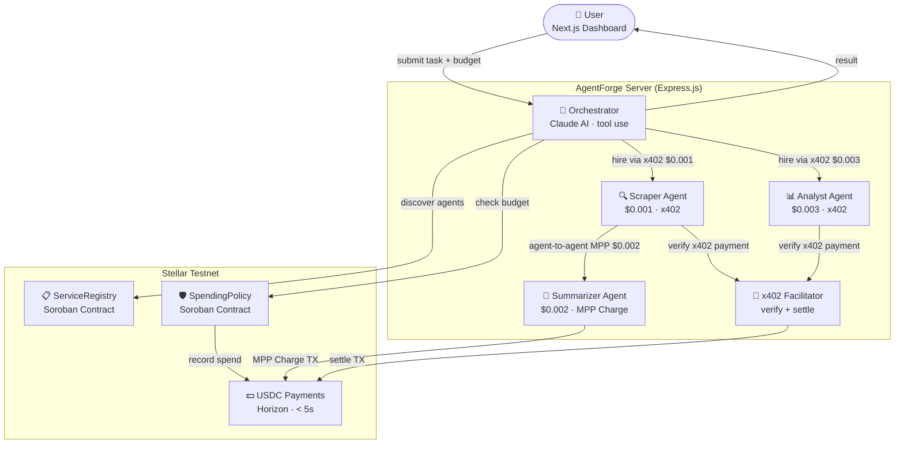
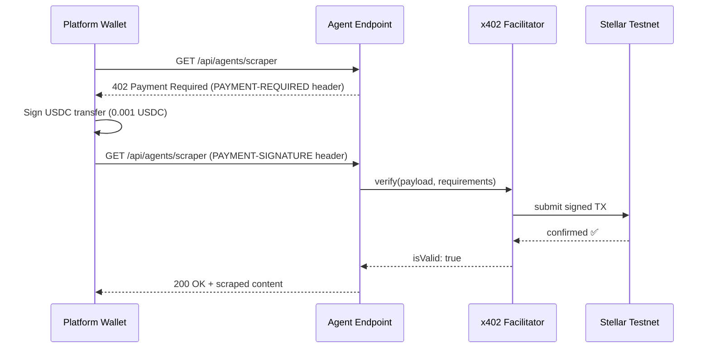
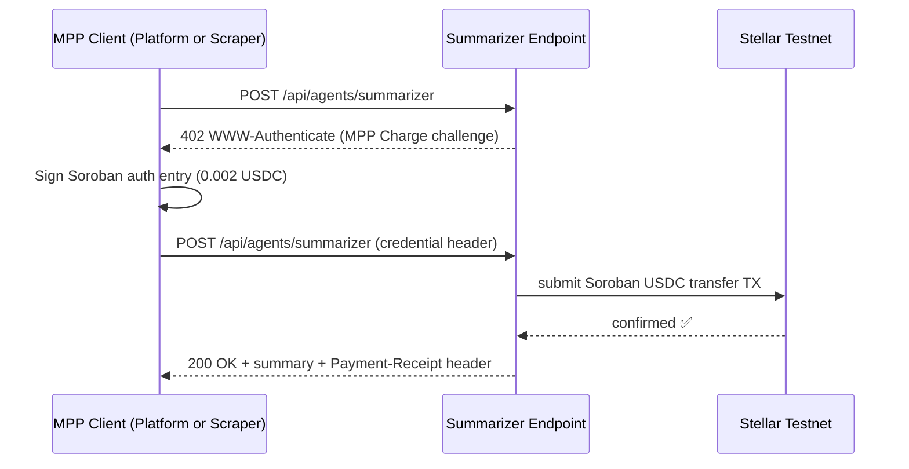

# AgentForge

> A multi-agent service economy on Stellar where AI agents autonomously discover, hire, and pay each other via **x402** and **MPP Charge** micropayments and Soroban smart contracts — no wallets, no API keys, no human in the loop.

[](https://dorahacks.io/hackathon/stellar-agents-x402-stripe-mpp/detail)
[](https://stellar.expert/explorer/testnet)
[](LICENSE)

---

## Table of Contents

- [Overview](#overview)
- [Why Stellar](#why-stellar)
- [Live Demo](#live-demo)
- [Architecture](#architecture)
- [Tech Stack](#tech-stack)
- [Project Structure](#project-structure)
- [Getting Started](#getting-started)
- [Smart Contracts](#smart-contracts)
- [Payment Flows](#payment-flows)
- [API Reference](#api-reference)
- [Environment Variables](#environment-variables)

---

## Overview

AgentForge solves a fundamental problem in AI agent systems: **agents cannot pay each other**.

Every AI API today is either free (rate-limited) or subscription-based ($99/month flat). Micropayments were impossible because every payment rail had minimum fees that exceeded the value of the transaction.

| Rail | Fee per transaction | $0.001 payment viable? |
|---|---|---|
| Bank wire | $25.00 | No — fee is 25,000× the payment |
| Stripe | $0.30 | No — fee is 300× the payment |
| Ethereum | $2.00 | No — fee is 2,000× the payment |
| **Stellar** | **$0.000001** | **Yes — fee is 0.1% of the payment** |

AgentForge uses Stellar's fee structure to build the first truly autonomous agent-to-agent service economy.

**What it does:**

1. User submits a task (e.g. *"Research the top 3 Stellar DeFi projects"*) with a USDC budget
2. The Orchestrator (Claude AI) decomposes the task into subtasks
3. It queries the on-chain **ServiceRegistry** (Soroban) to discover available specialist agents
4. It checks the **SpendingPolicy** (Soroban) to verify budget constraints
5. It hires each agent — paying **$0.001–$0.003 USDC per call** via **x402** (Scraper, Analyst) and **MPP Charge** (Summarizer)
6. Payments settle on Stellar testnet in under 5 seconds
7. The Scraper can autonomously hire the Summarizer directly — a true **agent-to-agent payment** with no Orchestrator involvement
8. User receives a complete, AI-generated report

Total cost: **$0.006 USDC** across 3 Stellar transactions, completed in under 30 seconds.

---

## Why Stellar

- **$0.000001 per transaction** — the only rail where $0.001 agent payments are profitable
- **x402 protocol** — HTTP-native pay-per-call, no API keys or subscriptions
- **MPP Charge** — draft-stellar-charge-00 machine-to-machine payment flows for programmable access
- **Soroban smart contracts** — on-chain service registry and spending guardrails
- **USDC native** — stable micropayments without volatility risk
- **5-second finality** — agents don't wait for payment confirmation

---

## Live Demo

**Deployed contracts on Stellar Testnet:**

| Contract | Address | Explorer |
|---|---|---|
| ServiceRegistry | `CDQXE54HXAIB7SPAWR7MMJAJT6JBMKFDDLOITBVRXXTME7UHO43PLRH3` | [View ↗](https://stellar.expert/explorer/testnet/contract/CDQXE54HXAIB7SPAWR7MMJAJT6JBMKFDDLOITBVRXXTME7UHO43PLRH3) |
| SpendingPolicy | `CAVKJDIF5CWDRTRGQCVETSRFDSMDNSHPAVI6UE342G76ZK3JST2TKDAE` | [View ↗](https://stellar.expert/explorer/testnet/contract/CAVKJDIF5CWDRTRGQCVETSRFDSMDNSHPAVI6UE342G76ZK3JST2TKDAE) |

To run locally: see [Getting Started](#getting-started).

---

## Architecture



### x402 Payment Flow (Scraper & Analyst)



### MPP Charge Flow (Summarizer)



### Agent-to-Agent Payment (Scraper → Summarizer)

When the Orchestrator calls the `scrape_and_summarize` tool, the Scraper autonomously hires the Summarizer using its **own Stellar wallet** — the Orchestrator is not involved in the payment:

```
Orchestrator → Scraper (x402 $0.001)
               Scraper → Summarizer (MPP $0.002 from SCRAPER_SECRET_KEY)
               ↑ True agent-to-agent: two separate wallets, zero platform involvement
```

---

## Tech Stack

| Layer | Technology |
|---|---|
| AI Orchestration | [Claude API](https://anthropic.com) with tool use (`claude-sonnet-4-6`) |
| Pay-per-call (x402) | [x402 protocol](https://github.com/coinbase/x402) (`@x402/stellar`, `@x402/express`) |
| Pay-per-call (MPP) | MPP Charge — draft-stellar-charge-00 (`@stellar/mpp`, `mppx`) |
| Service Discovery | Soroban ServiceRegistry contract (Rust/WASM) |
| Spending Guardrails | Soroban SpendingPolicy contract (Rust/WASM) |
| Settlement | Stellar Testnet · USDC · < 5s finality |
| Backend | Express.js · TypeScript · WebSockets · Rate limiting |
| Frontend | Next.js 15 · Tailwind CSS v4 |
| Monorepo | Turborepo |

---

## Project Structure

```
AgentForge/
├── apps/
│   ├── server/                    # Express.js backend
│   │   └── src/
│   │       ├── agents/            # Orchestrator, Scraper, Summarizer, Analyst
│   │       ├── payments/          # x402 middleware, MPP client/server, agent-to-agent, ledger
│   │       ├── routes/            # tasks, agents, payments API routes
│   │       ├── stellar/           # Soroban RPC client, ServiceRegistry, SpendingPolicy
│   │       └── websocket/         # Real-time activity feed
│   └── web/                       # Next.js dashboard
│       ├── app/                   # App router pages
│       └── components/            # AgentActivityFeed, PaymentExplorer, ServiceRegistry,
│                                  # BudgetWidget, TaskSubmitForm, TaskResult
├── packages/
│   └── contracts/                 # Soroban smart contracts (Rust)
│       ├── service-registry/      # On-chain agent marketplace
│       └── spending-policy/       # Daily/per-tx USDC spending limits
├── .env.example                   # Environment variable template
└── turbo.json                     # Monorepo build config
```

---

## Getting Started

### Prerequisites

- **Node.js** 20+
- **Rust** + `wasm32-unknown-unknown` target (for contracts only)
- **Stellar CLI** (`cargo install --locked stellar-cli`)

### 1. Clone and install

```bash
git clone https://github.com/HACK3R-CRYPTO/AgentForge.git
cd AgentForge
npm install
```

### 2. Configure environment

```bash
cp .env.example .env
```

Fill in `.env` — see [Environment Variables](#environment-variables). You need:

- An **Anthropic API key** with credits ([console.anthropic.com](https://console.anthropic.com))
- **7 Stellar testnet keypairs** — generate with `stellar keys generate --network testnet`
- A **platform wallet funded with testnet USDC** (see [apps/server/README.md](apps/server/README.md) for funding instructions)

### 3. Start the backend

```bash
cd apps/server
npx tsx src/index.ts
```

On startup you will see:
```
✓  Soroban RPC reachable
✓  ServiceRegistry: CDQXE54H...
✓  SpendingPolicy:  CAVKJDIF...
[Registry] Registering agents on Soroban ServiceRegistry…
AgentForge server  →  http://localhost:4021
x402 Facilitator   →  http://localhost:4022
WebSocket feed     →  ws://localhost:4021
```

### 4. Start the frontend

```bash
cd apps/web
npm run dev
```

Dashboard at `http://localhost:3000`.

### 5. Submit a task

Open `http://localhost:3000`, type a task, set a budget ($0.006–$0.05 is enough), and click **Launch Agent Swarm**. Watch the Live Activity feed as agents are hired and payments settle.

### Mock mode (no API keys needed)

Set `MOCK_MODE=true` in `.env` to run a simulated demo with no real AI calls or payments — useful for frontend development.

---

## Smart Contracts

Both contracts are deployed on Stellar Testnet. Source is in `packages/contracts/`.

### ServiceRegistry

On-chain marketplace for agent services. Agents register on startup — the Orchestrator queries this contract before hiring to discover which agents are available and what they cost.

**Key functions:**

| Function | Description |
|---|---|
| `register(agent, name, description, endpoint, price, payment_type, category)` | Register an agent (payment_type: 0=x402, 1=MPP) |
| `query_all()` | Return all registered services |
| `record_call(service_id)` | Increment the call counter after each hire |

### SpendingPolicy

Enforces programmable spending limits for the Orchestrator wallet. Prevents runaway agent spending.

**Key functions:**

| Function | Description |
|---|---|
| `initialize(admin, daily_limit, per_tx_limit)` | Set budget caps (in stroops) |
| `check_and_record(caller, amount, recipient)` | Verify budget and record spend atomically |
| `get_remaining(caller)` | Return remaining daily budget |

---

## Payment Flows

### Flow 1 — x402 Pay-per-Request (Scraper & Analyst)

```
1. Platform wallet  →  GET /api/agents/scraper
2. x402 middleware  ←  402 PAYMENT-REQUIRED (price: 0.001 USDC, payTo: SCRAPER_PUBLIC_KEY)
3. x402 client      →  signs USDC transfer, retries with PAYMENT-SIGNATURE header
4. x402 Facilitator →  verifies + submits TX to Stellar testnet
5. Server           ←  200 OK + content
6. recordPayment()  →  logs tx hash + amount to in-memory ledger (protocol: "x402")
```

### Flow 2 — MPP Charge (Summarizer)

```
1. MPP client       →  POST /api/agents/summarizer
2. mppGuard         ←  402 WWW-Authenticate (MPP Charge challenge, amount: 0.002 USDC)
3. MPP client       →  signs Soroban auth entry, retries with credential header
4. mppGuard         →  submits Soroban USDC transfer TX to Stellar testnet
5. Server           ←  200 OK + summary + Payment-Receipt header
6. recordPayment()  →  logs tx hash + amount to in-memory ledger (protocol: "mpp")
```

### Flow 3 — Agent-to-Agent (Scraper → Summarizer)

```
1. Orchestrator calls scrape_and_summarize tool
2. Scraper fetches URL (x402, $0.001 from Platform wallet)
3. Scraper's own MPP client (SCRAPER_SECRET_KEY) calls /api/agents/summarizer
4. mppGuard issues MPP Charge challenge
5. Scraper wallet pays Summarizer wallet $0.002 directly
6. Two Stellar TXs settle — Orchestrator wallet uninvolved in step 3–5
```

---

## API Reference

### Tasks

| Method | Endpoint | Body / Params | Description |
|---|---|---|---|
| `POST` | `/api/tasks` | `{ prompt, budget }` | Submit a task. Budget: $0.001–$0.50 USDC |
| `GET` | `/api/tasks/:id` | — | Poll task status and result |
| `GET` | `/api/tasks` | — | List all tasks |

### Agents

| Method | Endpoint | Gate | Description |
|---|---|---|---|
| `GET` | `/api/agents/scraper?url=` | x402 ($0.001) | Scrape and extract content from a URL |
| `POST` | `/api/agents/summarizer` | MPP Charge ($0.002) | Summarize text `{ text, style }` |
| `POST` | `/api/agents/analyst` | x402 ($0.003) | Analyze data `{ data, question }` |
| `GET` | `/api/agents` | None | List all registered services |

### Payments

| Method | Endpoint | Description |
|---|---|---|
| `GET` | `/api/payments/history` | Payment ledger (x402 + MPP, newest first) |
| `GET` | `/api/payments/budget` | Soroban SpendingPolicy status |
| `GET` | `/api/payments/balances` | USDC balances for all agent wallets |

### Debug (no payment required, rate-limited to 10/min)

| Method | Endpoint | Description |
|---|---|---|
| `GET` | `/test/scraper?url=` | Test scraper directly |
| `GET` | `/test/summarizer?text=` | Test summarizer directly |
| `GET` | `/test/analyst` | Test analyst directly |
| `GET` | `/health` | Server health + contract IDs + mock mode status |

---

## Environment Variables

| Variable | Description |
|---|---|
| `ANTHROPIC_API_KEY` | Claude API key |
| `ORCHESTRATOR_PUBLIC_KEY` | Stellar public key — signs Soroban contract calls |
| `ORCHESTRATOR_SECRET_KEY` | Stellar secret key — signs Soroban contract calls |
| `PLATFORM_PUBLIC_KEY` | Stellar public key — pays agents via x402 (must hold USDC) |
| `PLATFORM_SECRET_KEY` | Stellar secret key — pays agents via x402 |
| `SCRAPER_PUBLIC_KEY` | Stellar public key — receives x402 payments; also pays Summarizer via MPP |
| `SCRAPER_SECRET_KEY` | Stellar secret key — used for agent-to-agent MPP payments |
| `SUMMARIZER_PUBLIC_KEY` | Stellar public key — receives MPP Charge payments |
| `SUMMARIZER_SECRET_KEY` | Stellar secret key — held by Summarizer agent |
| `ANALYST_PUBLIC_KEY` | Stellar public key — receives x402 payments |
| `ANALYST_SECRET_KEY` | Stellar secret key — held by Analyst agent |
| `FACILITATOR_PUBLIC_KEY` | Stellar public key — x402 Facilitator settlement wallet |
| `FACILITATOR_SECRET_KEY` | Stellar secret key — x402 Facilitator settlement wallet |
| `MPP_SECRET_KEY` | Signing key for the MPP Charge server (can reuse `SUMMARIZER_SECRET_KEY`) |
| `SERVICE_REGISTRY_CONTRACT_ID` | Deployed Soroban ServiceRegistry contract address |
| `SPENDING_POLICY_CONTRACT_ID` | Deployed Soroban SpendingPolicy contract address |
| `USDC_CONTRACT_ID` | USDC Stellar Asset Contract address on testnet |
| `STELLAR_RPC_URL` | Soroban RPC endpoint (default: `https://soroban-testnet.stellar.org`) |
| `MOCK_MODE` | Set `true` to skip real AI/payments — useful for frontend dev |
| `PORT` | API server port (default: `4021`) |
| `FACILITATOR_PORT` | Facilitator server port (default: `4022`) |
| `FRONTEND_URL` | Frontend origin for CORS (default: `http://localhost:3000`) |

---

## Business Model

AgentForge is currently demo-funded — the platform wallet pays all agent costs directly so judges and testers can use it without any crypto setup.

In a production deployment, a single Stripe payment step sits in front of task submission:

```
User pays platform   →  $0.10 per task  (Stripe / card / fiat)
Platform pays agents →  $0.006 in USDC  (Stellar micropayments)
Platform keeps       →  $0.094 profit   per task
```

The user never touches crypto, never holds a wallet, never sees Stellar. They just pay with a card like any other web app. All the x402 and MPP complexity is invisible to them.

**At scale (1,000 agents × 1,000 calls/day):**

| Cost | Traditional (Stripe per call) | AgentForge (Stellar) |
|---|---|---|
| Daily transaction fees | $300,000 | $1.00 |
| Monthly fees | $9,000,000 | $30 |
| Viable at $0.001/call? | Never | Always |

Stellar makes the unit economics work. That is the whole point.

---

## License

MIT — built for Stellar Hacks: Agents 2026. Every line open source.
